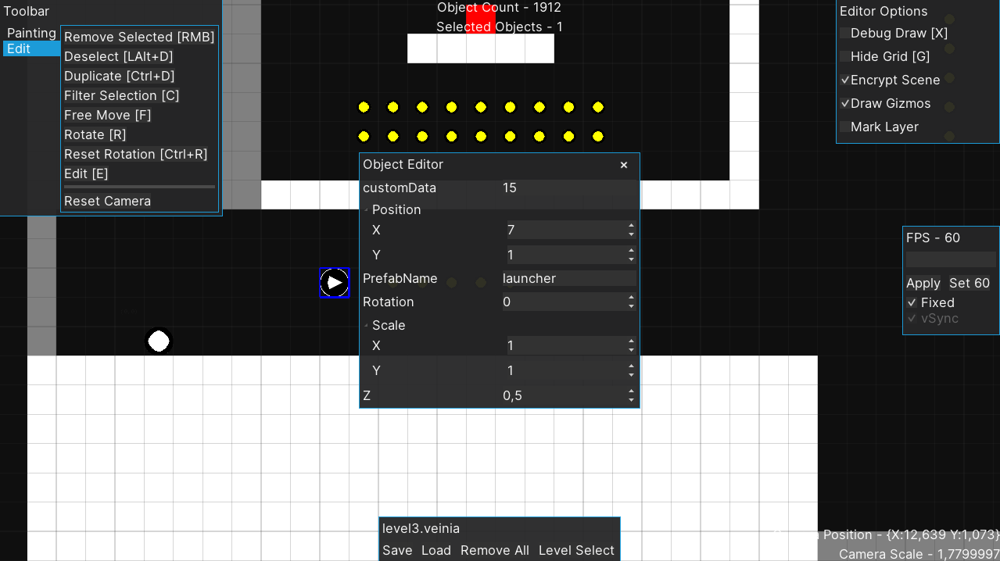
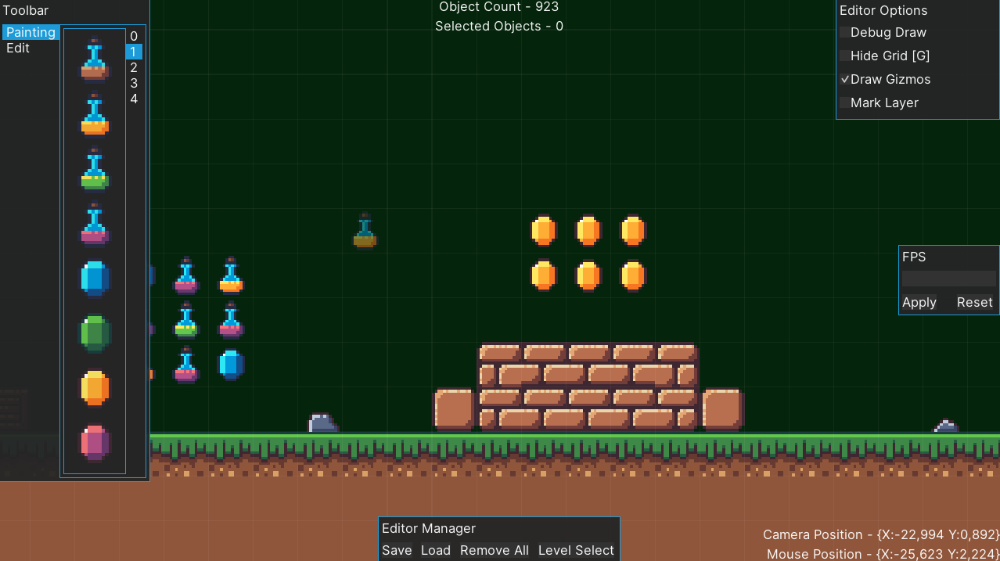

# Veinia-Framework
C# Game Creation Tool
<br>
[](https://choosealicense.com/licenses/mit/)

## Features
An independent framework that extends MonoGame helping you jump straight into developing with ready-to-use features such as:
* Level->GameObject->Component System
* Loading/Unloading Levels
* Powerful Prefab-Based Level Editor
* Unity-like Input System
* Binary Level Encryption
* Aether.Physics For 2D Realtime Simulations
* Particle Effects
* 2D Camera (Shake, Lookahead)
* Screen System With Viewport Scaling
* Changing Shaders (Automatic Sprite Batching)
* Mixing SpriteBatch With GraphicsDevice Drawing
* World Tools (Instantiating, Finding By Components)
* Built-in Components (Parallax, Sprite)
* Useful Debug Tools
* Two Handy UI Systems (GeonBit & Myra)



## Installation

Because certain libraries (such as GeonBit.UI) require referencing the Content folder, Veinia Framework must be installed manually as a project linked to your development environment. This approach also makes it easier to customize and adapt the source to your needs.

1. **Download Source**
2. **Link To Project:** Make sure that your project references ```Veinia``` in the .csproj file
```xml
<ItemGroup>
  <ProjectReference Include="(PATH)\Veinia Framework\Veinia.csproj" />
</ItemGroup>
```
or by using the terminal

```xml
dotnet add reference "(PATH)\Veinia Framework\Veinia.csproj"
```

3. **(Visual Studio) - Add To Solution:** Ensures Veinia is built when the solution is compiled, generating its output files correctly.
```xml
dotnet sln add "(PATH)\Veinia Framework\Veinia.csproj"
```

You should now be able to compile and use ```Veinia-Framework```  in your projects.

For proper functionality, ensure that level files are copied to the output directory. This can be done by adding the following to your .csproj file: (Use the correct path)
```xml
<ItemGroup>
  <None Update="LevelData\**\*">
    <CopyToOutputDirectory>PreserveNewest</CopyToOutputDirectory>
  </None>
</ItemGroup>
```

## Examples
Veinia comes with three sample projects to help you get started.



Initialization Example:
```csharp
var veinia = new Veinia((Game)this, graphics);
var screen = new Screen(1280, 720, fullscreen: false)

veinia.Initialize(GraphicsDevice, Content, Window, screen, unitSize: 100);

var level = new ForestLevel("forest.veinia"); // loads level data from .veinia
Globals.loader.DynamicalyLoad(level);
```

Custom Level Example (To Bring Up The Built-in Editor Press TAB):
```csharp
public class ForestLevel : Level
{
	public ForestLevel() { }
	public ForestLevel(string levelPath) : base(levelPath) { }

	public override void CreateScene(bool loadObjectsFromPath = true)
	{
		base.CreateScene(loadObjectsFromPath);

		var player = Instantiate(new Transform { Z = 1 }, new List<Component>
		{
			new Sprite("Shape/Square", Color.Green),
			new PhysicsRectangle(bodyType: BodyType.Dynamic),
			new Movement(),
		}, isStatic: false);
	}
}
```

Custom Component Example:
```csharp
public class Movement : Component, IDrawn
{
	private float speed = 10;

	public override void Update()
	{
		Vector2 direction = new Vector2(Globals.input.horizontal, Globals.input.vertical);
		body.LinearVelocity += direction * speed * Time.deltaTime;
	}

	public void Draw(SpriteBatch sb)
	{
		// debug draw current velocity
		sb.VeiniaTextWorld(this.level, transform.position, body.LinearVelocity.ToString());
	}
}
```

## Roadmap

* Lights
* Editor Undo & Redo
* Editor Handles
* Editor Automatic Tilemap Painting
