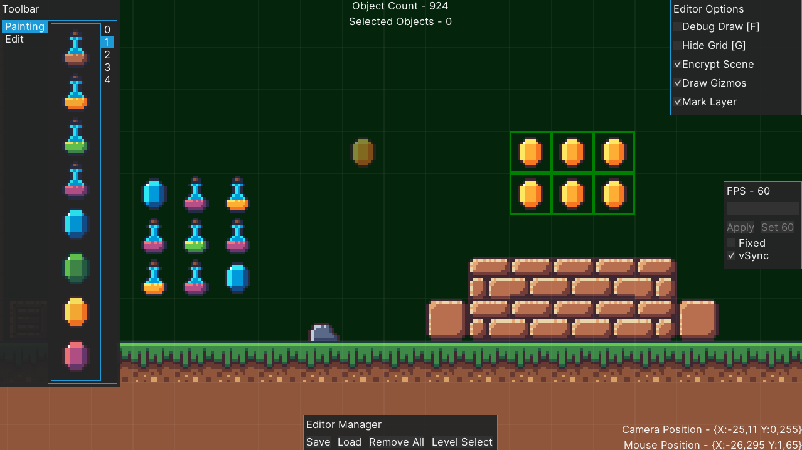

# Veinia-Framework
C# Game Creation Tool
<br>
[](https://choosealicense.com/licenses/mit/)

## Features
This tool simplifies the usage of the MonoGame Framework, it comes with a few things to give you a head start:
* Level->GameObject->Component System
* Prefab-Based Level Editor
* Aether.Physics for 2D Realtime Simulations
* Particle Effects
* Screen System
* Loading/Unloading Levels
* An Input System
* World Tools (Instantiating, Finding By Components)
* Useful Debug Tools
* Two Handy UI Systems (GeonBit & Myra)

## Installation

Veinia framework is only possible to be installed manually because of libraries such as GeonBit.UI which require referencing the Content folder

1. **Import:** Add existing ```Veinia``` project (.csproj) to your solution
2. **Reference:** Make sure that your project is referencing ```Veinia``` (Add -> Project Reference)

You should now be able to compile and use Veinia-Framework in your projects.

To avoid certain issues its best to copy .veinia editor files to output directory, for vs community its done in the following way:


## Examples
Veinia comes with a three sample projects to help you get started.



Initialization:
```csharp
var veinia = new Veinia((Game)this, graphics);
var screen = new Screen(1280, 720, fullscreen: false)

veinia.Initialize(GraphicsDevice, Content, Window, screen, unitSize: 100, Vector2.UnitY * -20);

Globals.loader.DynamicalyLoad(new Level("Level1.veinia"));
```

Custom Level (To Bring Up The Built-in Editor Press TAB While Playing a Level):
```csharp
public class ForestLevel : Level
{
	public ForestLevel(string levelPath) : base(levelPath)
	{
	}

	public override void CreateScene(bool loadObjectsFromPath = true)
	{
		base.CreateScene(loadObjectsFromPath);

		var player = Instantiate(new Transform(Vector2.Zero), new List<Component>
		{
			new Sprite("Sprites/Player", layer: 0, Color.Green, pixelsPerUnit: 200),
			new Movement()
		}, isStatic: false);

		player.body = Globals.physicsWorld.CreateRectangle(width: 300, height: 100, density: 1, bodyType: BodyType.Dynamic);
	}
}
```

Custom Component:
```csharp
public class Movement : Component
{
	private float speed = 10;

	public override void Update()
	{
		var movement = new Vector2(Globals.input.horizontal, Globals.input.vertical) * speed;
		body.LinearVelocity += movement;
	}
}
```

## Roadmap

* Lights
* 2D Optimizations
* Editor Undo & Redo
* Editor Handles
* Editor Automatic Tilemap Painting
